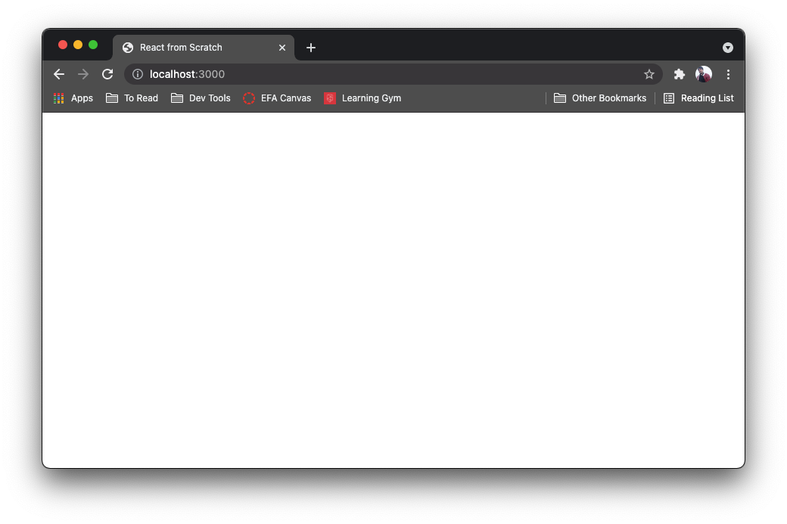
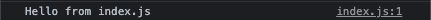

# 2 - Webpack Install and Config

## Why Webpack?

The first thing that we need to install is Webpack, which is a package that will take all of your project files and bundle them up for us. The reason we need this is because the browser doesn’t know how to read Javascript modules, which is just referring to all of the importing of files you do in a project. Anytime you write `const express = require(‘express')` or `import React from 'react'` you are using modules.

On the browser every script needs to be connected directly to the HTML file, which can get really unruly if you have 20 script imports on multiple pages. Webpack takes care of that for us.

---

## Webpack Packages

Let’s install 2 packages we’ll need to use Webpack

- `webpack` - the main package that does the bundling
- `webpack-cli` - the CLI so we can start the app and bundle it

```shell
npm install --save-dev webpack webpack-cli
```

Before we forget, let’s setup a `.gitignore` so we don’t accidentally commit the `/node_modules` folder to our git repo. You can run the following on Mac or just add the file manually in VS Code

```shell
touch .gitignore
```

Go ahead and add the following to your `.gitignore`.

```
# .gitignore
/node_modules
/dist
```

The reason we are adding `’dist` here is because we don’t want to save our bundled code in the repo. That will all get built whenever the project is deployed so there is no reason to store it in the repo.

---

## Webpack Configuration

In order to make use of webpack we first need to configure it. This is done with the help of a `webpack.config.js` file. Let’s create one in our the root project folder either with the following command or in VS Code.

```shell
touch webpack.config.js
```

Inside of this file we are going to tell webpack how to actually go about packaging everything up.

```javascript
const path = require('path');

module.exports = {
	// This tells webpack what environment to run in. Don't worry too much about this, just know that setting it to development gives us some useful tools.
	mode: 'development',
	// Webpack creates a graph of all the files in your application based on how they are all connected. This declares which file to start from.
	entry: './src/index.js'
	// Where webpack should put the bundled up code it creates.
	output: {
		// This is the directory where we want to put the bundled file. It must be an absolute path, hence the use of the path module from node.
		path: path.resolve(__dirname, 'dist'),
		// The name of the file where all of the code is bundled.
		filename: 'bundle.js',
		// This tells your application where to look for the files to use.
		publicPath: '/dist'
	},
	// These are the files that webpack should worry about
	resolve: {
		extensions: ['.js', '.jsx']
	}
}
```

---

## Webpack Scripts

Now that we have those configurations done, let’s add a couple of scripts for ease of development. In your `package.json` write the following in the “scripts” section.

```json
"scripts" : {
	"build": "webpack"
}
```

Now, let’s see if we hooked everything up correctly. Let’s run our start script

```shell
npm run build
```

You should see a `/dist` folder generate in your project which contains all of the files your html page will link to. Run Live Server on your html file and you should get… An empty webpage?


Let’s write something in our `index.js` file.

```javascript
console.log('Hello from index.js');
```

If we save the file, now what?

It should still be a blank page, but take a look in the browser’s console.


Webpack is bundling your files and your `index.html` file is using the bundled file we configured earlier.

---

## Webpack Dev Server

Now we have everything working and webpack is bundling our code into the `/dist` directory. However, if we want to make changes to our code and actually see them we would need to rerun the `build` script and refresh the page. This is fine, but can end up eating into our productivity while developing. For that reason there is another package, `webpack-dev-server`, that can manage all of the bundling and reload our project every time we save changes. It is functionally `nodemon` for webpack. So let’s install that and get it set up to make our development experience a little smoother.

First, let’s get the package installed.

```shell
npm install --save-dev webpack-dev-server
```

Once the package is installed, we need to add a few more configurations to our `webpack.config.js` file so the development server knows where to run.

```javascript
const path = require('path');

module.exports = {
	mode: 'development',
	entry: './src/index.js'
	output: {
		path: path.resolve(__dirname, 'dist'),
		filename: 'bundle.js',
		publicPath: '/dist'
	},
	resolve: {
		extensions: ['.js', '.jsx']
	},

	// Configurations for webpack-dev-server so it doesn't need to run a full build each time you make a change
	devServer: {
		static: {
			directory: path.join(__dirname, 'public/'),
		},
		// This is the port that your page will be on when we run the project
		port: 3000
	}
	// ^^^^^^^^^^^^^^^^^^^^^^^^
}
```

Now that we have configurations set up, let’s add another script to our `package.json`.

```diff
"scripts" : {
+	"start": "webpack-dev-server --open",
	"build": "webpack"
}
```

Now if we run `npm start` after saving our files, your browser should open your project, and if you make any changes, such as what the `console.log` prints in our `index.js`, your page should reload and reflect those changes.

Now that we have the development environment set up, let’s get React installed and working.

---

## Current File Structure

Before we move on, double-check that your file structure is similar to the one below.

```
├── dist
├── node_modules
├── public
│   └── index.html
├── src
│   └── index.js
├── .gitignore
├── package-lock.json
├── package.json
└── webpack.config.js
```
