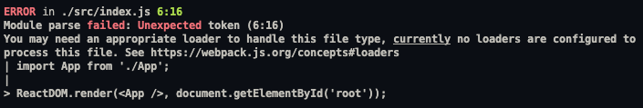
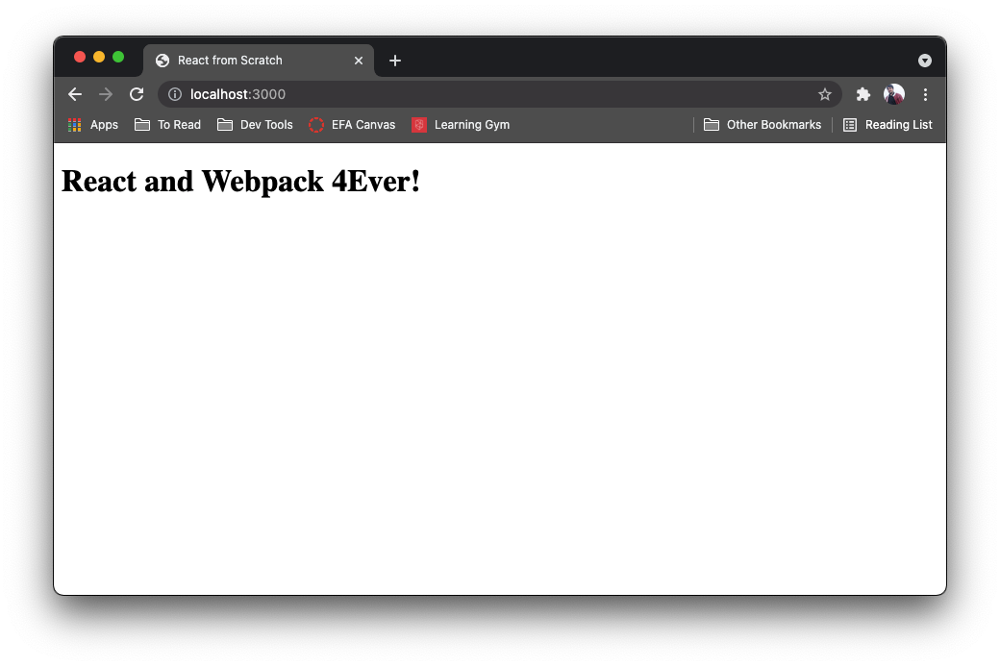

# 3 - React Configuration

## Adding React

Now we are ready to add the react packages we need. For this framework, we will only be adding the `react` and `react-dom` packages. Let’s go ahead and get those installed.

```shell
npm install --save react react-dom
```

---

## App.js

Now that we have React installed on the project let’s go ahead and create an `App.js` in the `src` folder.

```shell
touch src/App.js
```

Go ahead and fill in the following code to your newly created file.

```javascript
import React from 'react';

function App() {
  return <h1>React and Webpack 4Ever!</h1>;
}

export default App;
```

---

## Index.js

Your page still isn’t displaying anything, but that’s because we still need to import our component into `index.js` and render it. Update your `index.js` file to the following.

```javascript
import React from 'react';
import ReactDOM from 'react-dom';

import App from './App';

ReactDOM.render(<App />, document.getElementById('root'));
```

If you save it and then try to run your project you should get an error like this.


But why did it break? It was all working fine until we updated `index.js`. Well, it has to do with JSX.

Webpack, by default, only knows how to parse plain javascript. It can’t load anything else by default. In this case we are trying to use JSX syntax, but webpack doesn’t know what to do with that because it hasn’t been translated into plain javascript. To do that, we need to use a tool called Babel.

---

## Babel

Babel is a tool that can translate new, cutting edge JavaScript into JavaScript older browsers can understand, since not every new feature gets implemented in every browser at the same time. Especially useful for us, it can also translate JSX into vanilla Javascript that Webpack and the browser can understand. If you are curious to learn more about Babel take a bit and read through some of [Babel · The compiler for next generation JavaScript](https://babeljs.io/).

In order for us to make use of babel, we need to download a few more packages.

- `@babel/core` - The main babel package
- `@babel/preset-env` - This takes care of the babel configuration, so you don’t need to worry about which flavor of javascript to target and a lot of other complicated configurations.
- `@babel/preset-react` - This is the package that specifically deals with React and takes care of all of the translation and configuration necessary for translating it to Javascript
- `babel-loader` - This package is what Webpack will use to translate JSX into something it can use when it bundles up our code.

```shell
npm install --save-dev @babel/core @babel/preset-env @babel/preset-react babel-loader
```

### Babel Configuration

Before we can make use of Babel fully we need to create a configuration file so it knows which presets to use. This file is called `.babelrc`. Let’s add a `.babelrc` to our root project folder and include the following configurations.

```json
{
  "presets": ["@babel/preset-env", "@babel/preset-react"]
}
```

You can see we are making use of 2 of the babel packages we just downloaded to tell our application how it should translate our code to plain Javascript.

### Babel Loader

If you try to run your application it still won’t work, and that is because we haven’t told webpack how to deal with JSX. To do that we need to define rules so webpack knows how to handle the files with JSX in them. To do this we will add some more info to our `webpack.config.js`. The code to add is the following,

```javascript
const path = require('path');

module.exports = {
  mode: 'development',
  entry: './src/index.js',
  output: {
    path: path.resolve(__dirname, 'dist'),
    filename: 'bundle.js',
    publicPath: '/dist',
  },
  // THIS IS WHAT WE ARE ADDING
  module: {
    // These are the rules that webpack will follow in order to decide how to process specific files.
    rules: [
      {
        // This defines the file extension for the rule
        test: /\.jsx?$/,
        // Exclude any files we don't want translated
        exclude: /node_modules/,
        // Which loader to use for the files with the givern extension
        loader: 'babel-loader',
      },
    ],
  },
  // ^^^^^^^^^^^^^^^^^^^^^^^^^^^
  resolve: {
    extensions: ['.js', '.jsx'],
  },
  devServer: {
    static: {
      directory: path.join(__dirname, 'public/'),
    },
    port: 3000,
  },
};
```

Once you have added those configurations, if you restart you application you should see it is running correctly.



Congratulations! You just got displayed JSX in the browser. Next up, let’s see if we can add some basic styles using CSS.

---

## Current File Structure

Before we move on, double-check that your file structure is similar to the one below.

```
├── node_modules
├── public
│   └── index.html
├── src
│   ├── App.js
│   └── index.js
├── .babelrc
├── .gitignore
├── package-lock.json
├── package.json
└── webpack.config.js
```

---

[Previous Module](../2-webpack-config)
[Next Module](../4-css-styling)
