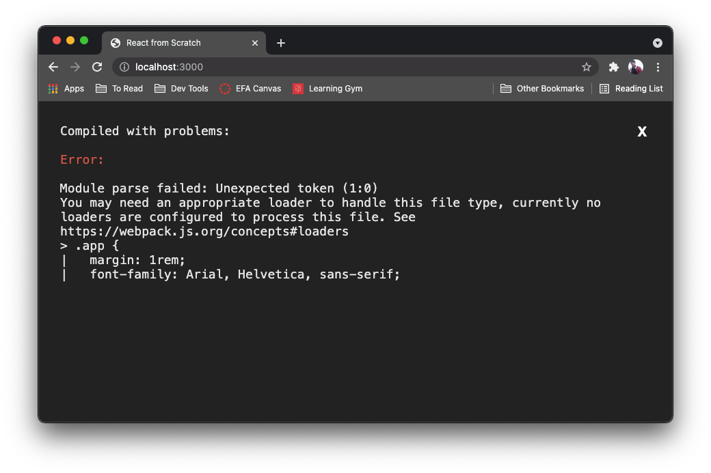
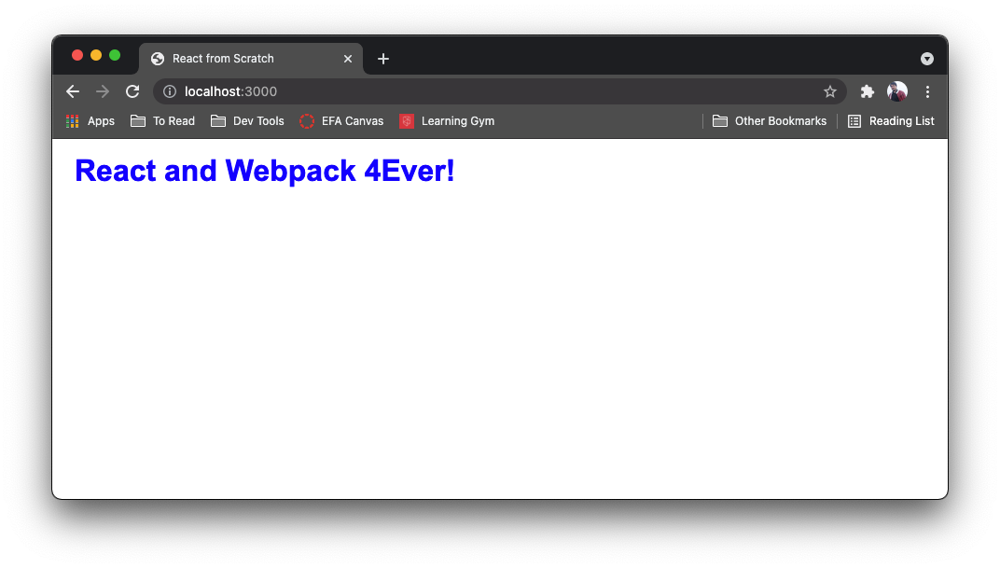

# 4 - CSS Styling

For this module, we are going to add some basic styles to our JSX using CSS Modules.

## CSS Modules

You will, at this point be quite familiar with CSS having used it on a number of projects. CSS Modules let us write CSS files that are specific to each component, which can then be imported much like a JavaScript file.

Let’s start by creating an `app.component.css` file in your `src` directory.

```shell
touch src/app.component.css
```

The extension `.component.css` let’s your application know you are using CSS modules. Let’s add a style rule to the file.

```css
.app {
  margin: 1rem;
  font-family: Arial, Helvetica, sans-serif;
  color: blue;
}
```

---

## App.js

To make use of this style inside our app component we need to import it and apply it to the component.

```diff
import React from 'react';
+ import styles from './app.component.css';

const App = () => {
-  return <h1>React and Webpack 4Ever!</h1>;
+	 return <h1 className={styles.app} > React and Webpack 4Ever!</h1>
}

export default App;

```

When using CSS modules, the styles are imported as an object, which can then be used to apply class styles to a specific component using the `className` property.

If we take a look at our website, what do we have?



It looks like we don’t have the right loader set up. As is, Webpack doesn’t know how to handle CSS files, so we will need to tell it what to do with them. For that we will need to install 2 more packages.

- `style-loader`
- `css-loader`

```shell
npm install --save-dev style-loader css-loader
```

Once, they’ve been downloaded we need to setup a rule so webpack knows when to use them, just like the `babel-loader` from the last module. So we are going to add another rule to our `webpack.config.js` file.

```javascript
const path = require('path');

module.exports = {
  mode: 'development',
  entry: './src/index.js',
  output: {
    path: path.resolve(__dirname, 'dist'),
    filename: 'bundle.js',
    publicPath: '/dist',
  },
  module: {
    rules: [
      {
        test: /\.jsx?$/,
        exclude: /node_modules/,
        loader: 'babel-loader',
      },
      // OUR NEW RULE GOES HERE
      {
        // Apply the rule to any files with the .css extension
        test: /\.css$/,
        // Since we are using more than one loader to handle css files, we need to make use of the 'use' property and give it an array of the loaders in the order they should process.
        use: [
          'style-loader',
          {
            loader: 'css-loader',
            // This tells webpack we will be using CSS modules and not just plain CSS
            options: {
              modules: true,
            },
          },
        ],
      },
      // ^^^^^^^^^^^^^^^^^^^^^^^^^^^^^^^^^^^^
    ],
  },
  resolve: {
    extensions: ['.js', '.jsx'],
  },
  devServer: {
    static: {
      directory: path.join(__dirname, 'public/'),
    },
    port: 3000,
  },
};
```

With these configurations added, open up your webpage and you should see this.



We did it. Now you can use CSS modules throughout your project so you aren’t just serving plain old HTML. Adding support for Sass or Less is as simple as downloading and setting up the appropriate loaders. Now, let’s see if we can lay down some coding practices and styles for the whole project using linting.

---

## Current File Structure

Before we move on, double-check that your file structure is similar to the one below.

```
├── node_modules
├── public
│   └── index.html
├── src
│   ├── app.component.css
│   ├── App.js
│   └── index.js
├── .babelrc
├── .gitignore
├── package-lock.json
├── package.json
└── webpack.config.js
```

---

[Previous Module](../3-react-config)
[Next Module](../5-eslint)
