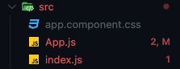
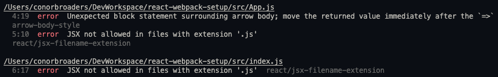
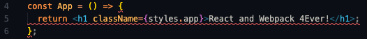

# 5 - ESLint

## What is linting?

If you have ever worked on a project with someone else, you may have noticed that you do some things differently. Someone may prefer function declarations (`function fn() {}`) and someone else may prefer function expressions (`const fn = () => {}`). Someone may use 2 spaces/tab and someone may use 4 spaces/tab. When you are working on your own project it isn’t really a huge issue, but if you are working with others, it would make for pretty messy code if people each used their own preferences and didn’t hold themselves to a consistent code style. That is where linters come in. Linters define code rules, both semantic (such as using fat arrow functions or the `function` keyword) and visual (how many spaces/tab, max length of a line of code). It then holds you to those rules by giving you errors or warnings when you are violating those rules and can even fix some of them automatically.

## ESLint

ESLint is one of the most popular linters for JavaScript and will be the one that we use for this project. Setting up a linter with all of the rules you want to follow can take a long time and be really finicky, so we are going to make use of some predefined rules to help you write consistent and beautiful code. If you do want to take a look at what sort of rules you can set up, take a look at the [ESLint Website](https://eslint.org/)

---

## Helpful Extension

Before we get started with ESLint in the project, let’s download a helpful VS Code extension that will highlight errors and warnings triggered by our linting rules. The extension is **ESLint** and it is pictured below.


Once you have it installed from the extensions marketplace, we can move along with our ESLint installation in our project.

---

## Installing ESLint

First things first, let’s get `eslint` installed in our project.

```shell
npm install --save-dev eslint
```

Once you have that done, we are going to let the package set up the configurations for us (with some input from us).

Run the following command

```shell
npx eslint --init
```

This will run a script to set up the configurations for us. You should get a dialogue in your terminal, which will ask you to answer a few questions. The configurations to use are below.

```
How would you like to use ESLint? -
	> To check syntax, find problems, and enforce code style
What type of modules does your project use? -
	> JavaScript modules (import/export)
Which framework does your project use? -
	> React
Does your project use TypeScript? -
	> No
Where does your code run? -
	> Browser
How would you like to define a style for your project? -
	> Use a popular style guide
Which style guide do you want to follow?
	> Airbnb
What format do you want your config file to be in?
	> JSON
```

Once all those questions are answered it will ask to download some additional dependencies. Answer **YES** to that. These are all the packages that contain all the rules for the style guide we selected and some React specific rules.

Once you have all of that downloaded, you should see that a `.eslintrc.json` file has been generated. It will have most of the configuration done, but we are going to add one setting at the bottom just so that our `/dist` folder doesn't throw hundreds of errors when you get eslint running.

```diff
{
  "env": {
    "browser": true,
    "es2021": true
  },
  "extends": ["plugin:react/recommended", "airbnb"],
  "parserOptions": {
    "ecmaFeatures": {
      "jsx": true
    },
    "ecmaVersion": 12,
    "sourceType": "module"
  },
  "plugins": ["react"],
  "rules": {},
+ "ignorePatterns": "/dist"
}
```

You’ll also see that some of you files are giving you errors now when you open them. That means ESLint is working, so now let’s use it.



---

## Using ESLint

Let’s add a script to our `package.json` to take advantage of ESLint.

```diff
...
	"scripts": {
		"start": "webpack-dev-server --open"
		"build": "webpack",
+		"lint:check": "eslint ."
	}
```

If we run `npm run lint:check` what do we see?



We’re getting some specific errors about styling and syntax, thanks to the prepackaged ESLint rules we got from the Airbnb style guide. Let’s fix a couple of them.

Two of the errors seem to be complaining that JSX should have the `.jsx` file extension. Let’s fix that by renaming our two `.js` files to `App.jsx` and `index.jsx`.

Once we do that, you should see the error on the newly renamed `index.jsx` go away, but it looks like we still have an error in `App.jsx`. Let’s take a look at that one.



If you hover over the error, you should see something like the following.


ESLint doesn’t like that we are using block body when all we are doing is returning something. The style guide we are using says we should use implicit return. If you don’t remember what that means take a second to review how fat arrow functions work.

---

## Overriding/Defining rules

Let’s say we don’t want to follow this specific rule, and that for our project we want to always use block body in an arrow function. How do we go about overriding this rule. Luckily, the error tells us what rule is triggering that specific error, `arrow-body-style`. You can read up on what this rule means on the ESLint docs [here](https://eslint.org/docs/rules/arrow-body-style#require-braces-in-arrow-function-body-arrow-body-style).

We can add our own configuration for this to the `.eslintrc.json` file under the `”rules”` property. Based on the documentation for the `arrow-body-style` rule, we want to set it to `"always"` so we add the following to the `.eslintrc.json`.

```diff
...
	"rules": {
+		"arrow-body-style": ["error", "always"]
	}
...
```

Once you save that, the error in our `App.jsx` should go away. And just like that you have configured your own custom rule for the project. There are a whole slew of different rules you can apply to a project using ESLint. If you want to see a list of them and read more about them, you can find that [here](https://eslint.org/docs/rules/).

---

## Complete?

And with that you have a customer project starter for React with linting. There are a ton of additional configurations and add-ons that you can make use of, such as webpack loaders for files like images, style libraries like Sass or Less, or even enabling TypeScript. You can get even more specific about your own coding style with ESLint rules and other Linting libraries. Go ahead and use this framework and make it your own by adding additional loaders, or configuring more ESLint rules to make the project work for you.

---

[<<< Previous Module](../4-css-styling)
